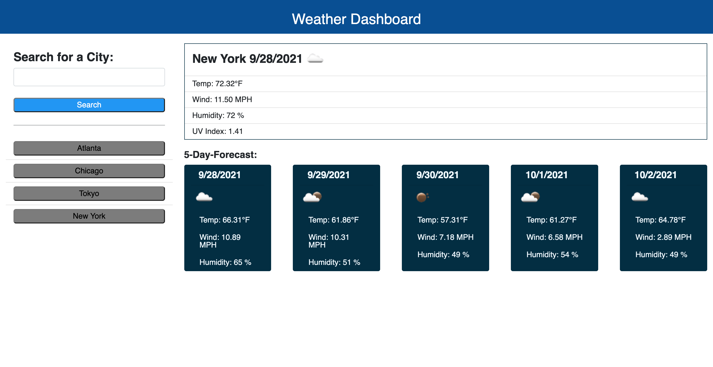

# Weather-Dashboard

## Description

In this project, my task is to build a weather dashboard application to display current weather information and forecast 5 days weather information by inputting city name.

## Third Party API

Use the [OpenWeather One Call API](https://openweathermap.org/api/one-call-api) to retrieve weather data for cities.

## Requirements

1. Weather dashboard with inputs.
2. Presented with current and future weather conditions for the city input.
3. Presented with city name, the date, an icon representation of weather conditions, the temperature, the humidity, the wind speed, adn the UV index.
4. Presented 5-day forecast weather conditions, which include the data, an icon representation of weather conditions, the temperature, the wind speed, and the humidity.
5. Button created with the city name input.

## Link URL for GitHub Repository

https://github.com/jingwang6028/Weather-Dashboard

## Link URL for GitHub Page

https://jingwang6028.github.io/Weather-Dashboard/

## Mock-up Image

This image shows the application's appearance and functionality.

